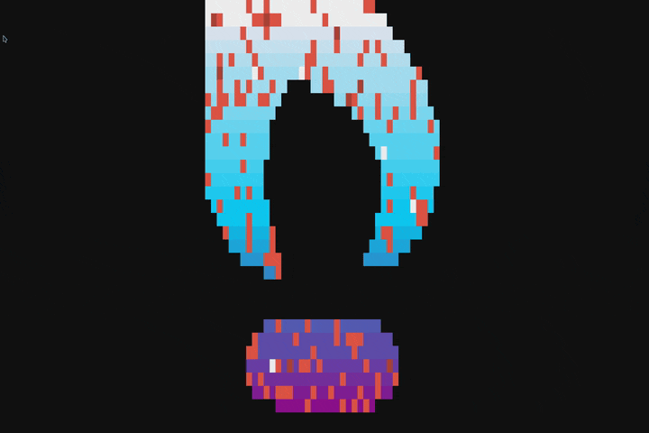
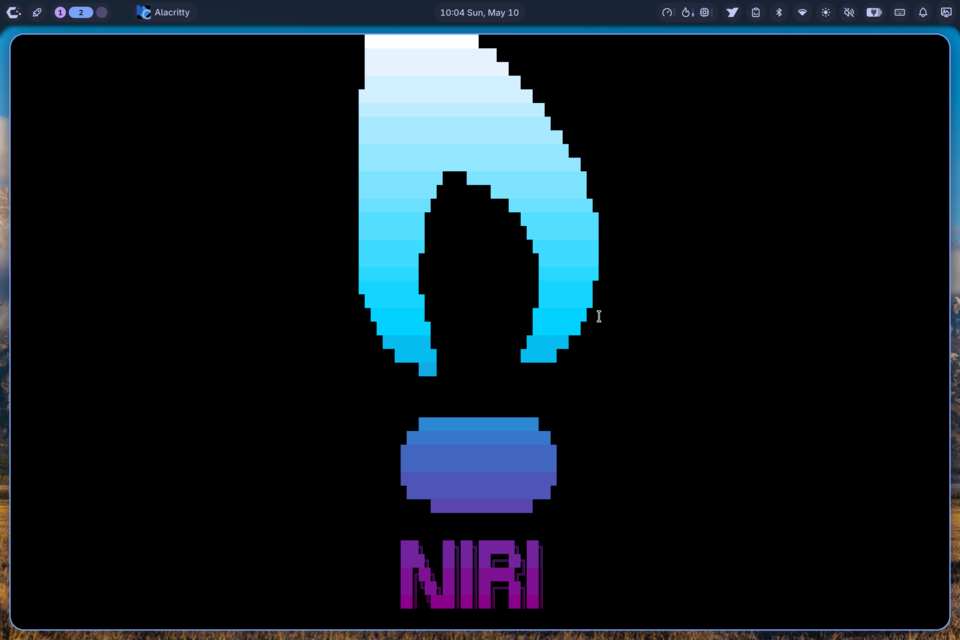

# niri-screensaver

[](LICENSE)
[](https://github.com/jfreed-dev/niri-screensaver/releases)
[](https://github.com/jfreed-dev/niri-screensaver/actions/workflows/ci.yml)

A terminal-based screensaver for [Niri](https://github.com/YaLTeR/niri), driven by
[TerminalTextEffects](https://github.com/ChrisBuilds/terminaltexteffects) and
designed to integrate with the [Noctalia](https://github.com/noctalia-dev/noctalia-shell)
desktop shell.



> 8-second loop on CachyOS — `RANDOM_LOGO=true` happens to land on the Framework
> hex cog and one of TTE's color-gradient effects. (The visible cursor at the
> bottom is a known issue tracked in [`TODO.md`](TODO.md).)

Forked from [cosmic-order](https://github.com/jonfreed/cosmic-order)'s screensaver
component, with the COSMIC-specific glue (cosmic-randr, cosmic-greeter, the
focus-follows-cursor / autotile dance) stripped out and replaced with niri-native
equivalents. Idle, lock, and DPMS are deferred to Noctalia rather than reimplemented
in swayidle.

## Layout

```
bin/
  niri-screensaver         Inner driver — runs TTE in the current terminal.
  niri-screensaver-launch  Spawns one fullscreen Alacritty per output, runs the driver inside.
  niri-screensaver-ctl     Thin shim: launch | kill | toggle | status | test | effects.
share/
  alacritty-screensaver.toml  Minimal Alacritty config (black bg, no padding, hidden cursor).
  logos/                       ASCII art logos (Framework cog, CachyOS shield, combos). See `Logos` below.
docs/
  niri-window-rule.kdl         Snippet for ~/.config/niri/config.kdl.
  noctalia-customCommand.json  Snippet for ~/.config/noctalia/settings.json idle.customCommands.
noctalia-plugin/                Native Noctalia plugin (manifest + QML).
install.sh                     User-local install (defaults to ~/.local).
```

## Requirements

| Package | Required | Purpose |
|---------|----------|---------|
| `niri` | yes | The compositor; window-rule + `niri msg action spawn` |
| `alacritty` | yes | Host terminal for the fullscreen screensaver surface |
| `terminaltexteffects` (`tte`) | yes | Renders the actual effects |
| `jq` | optional | Used by the launcher to enumerate outputs |
| `figlet` | optional | Renders the between-effects clock |
| `notify-send` (`libnotify`) | optional | Toggle / status notifications |

Install the dependencies for your distro:

```bash
# Arch / CachyOS
paru -S python-terminaltexteffects alacritty niri jq figlet libnotify

# Fedora / RHEL
sudo dnf install alacritty niri jq figlet libnotify
pipx install terminaltexteffects

# Debian / Ubuntu
sudo apt install alacritty jq figlet libnotify-bin
pipx install terminaltexteffects
# (niri may need a manual install on older releases)
```

The Noctalia plugin additionally requires Noctalia ≥ 4.7.0 (uses the plugin
API's `tr()` translation helper and Tabler icon names).

## Install

```bash
./install.sh                             # installs into ~/.local
INSTALL_PREFIX=/usr/local ./install.sh   # system-wide
```

This deploys the three `bin/` scripts and the `share/` assets (Alacritty
config + logos). It does **not** install the niri window-rule or the
Noctalia plugin — those are separate steps below.

Verify with:

```bash
niri-screensaver-ctl status
niri-screensaver-ctl test     # render one effect inline (no fullscreen)
```

## Wire it into Niri

Append the contents of `docs/niri-window-rule.kdl` to your `~/.config/niri/config.kdl`.
The rule matches `app-id="niri-screensaver"` and applies `open-fullscreen true`,
which is how the launcher achieves fullscreen without an Alacritty CLI flag.

## Wire it into Noctalia

Two options.

### Option A — Native plugin (recommended)

The `noctalia-plugin/` subdirectory ships a Noctalia plugin (manifest + QML)
that adds a Settings tab, a bar widget, and auto-registers the screensaver
in Noctalia's IdleService when enabled. See `noctalia-plugin/README.md` for
install instructions (point Noctalia at this repo URL as a custom plugin source).



> Niri logo mid-gradient with the Noctalia bar visible at the top — the
> plugin's bar widget (custom monitor-with-image icon, far left of the
> tray cluster) launches the screensaver on click.

### Option B — Manual JSON edit

Copy the relevant fields from `docs/noctalia-customCommand.json` into
`~/.config/noctalia/settings.json` under the `idle` object. After saving,
restart Noctalia (`pkill qs` then re-launch `qs -c noctalia-shell`) to pick
up the new idle hook.

## Usage

```bash
niri-screensaver-ctl launch    # trigger now
niri-screensaver-ctl kill      # stop
niri-screensaver-ctl status    # report state
niri-screensaver-ctl toggle    # disable / re-enable the launcher
niri-screensaver-ctl test      # run a single random effect inline (no fullscreen)
niri-screensaver-ctl effects   # list all TTE effects
```

## Configuration

`~/.config/niri-screensaver/config` is sourced as shell. Keys:

| Key | Default | Notes |
|-----|---------|-------|
| `FRAME_RATE` | `60` | TTE frame rate |
| `INCLUDE_EFFECTS` | _empty_ | Comma-separated effect names; takes precedence over excludes |
| `EXCLUDE_EFFECTS` | `dev_worm` | Comma-separated effects to skip |
| `FADE_IN_EFFECT` | _empty_ | One-shot effect on launch (e.g. `expand`, `slide`) |
| `FADE_OUT_EFFECT` | _empty_ | One-shot effect on dismiss (e.g. `burn`, `crumble`) |
| `SHOW_CLOCK` | `false` | Render time between effects |
| `CLOCK_DURATION` | `3` | Seconds to display the clock |
| `CLOCK_FORMAT` | `%H:%M` | strftime format string |
| `CLOCK_FONT` | _empty_ | figlet font name |
| `CURSOR_HIDE` | `true` | Hide the *text* cursor (`tput civis`) |
| `DISMISS_ON_KEY` | `true` | Any key dismisses; ESC and mouse always dismiss |
| `RANDOM_LOGO` | `false` | When `true`, pick a random `*.txt` from `LOGO_DIR` before each effect cycle |
| `LOGO_DIR` | _empty_ | Directory the random picker scans. Defaults to the installed `share/logos/` |

The mouse pointer is left to niri — set `cursor { hide-after-inactive-ms }` in
your niri config to auto-hide it during the screensaver.

## Logos

`share/logos/` ships ready-to-use ASCII art. Point `LOGO_FILE` at one of them
in `~/.config/niri-screensaver/config` (or via the Noctalia plugin's Settings
panel) — or symlink your favorite to the active path:

```bash
ln -sf ~/.local/share/niri-screensaver/logos/framework-name-with-icon-medium.txt \
       ~/.config/niri-screensaver/logo.txt
```

| File | Contents |
|------|----------|
| `framework-icon.txt` | Real Framework 8-lobed cog logo (40×18, ASCII-ized from the official SVG) |
| `framework-icon-medium.txt` | Same cog, medium (30×14) |
| `framework-icon-small.txt` | Same cog, compact (24×10) |
| `framework-name.txt` | `FRAMEWORK` ANSI Shadow wordmark |
| `framework-name-with-icon.txt` | Cog (40×18) + wordmark |
| `framework-name-with-icon-medium.txt` | Cog (30×14) + wordmark |
| `framework-name-with-icon-small.txt` | Cog (24×10) + wordmark |
| `framework-name-with-cachyos-icon.txt` | CachyOS shield + `FRAMEWORK` wordmark (for CachyOS-on-Framework setups) |
| `cachyos-icon.txt` | CachyOS shield (lifted from fastfetch's CachyOS logo) |
| `cachyos-name.txt` | `CACHYOS` ANSI Shadow wordmark |
| `cachyos-name-with-icon.txt` | Shield + `CACHYOS` wordmark |
| `niri-icon.txt` | Real niri brand icon (stylized "i" / arguably owl-shaped, ASCII-ized from the official SVG, [CC BY-SA](https://creativecommons.org/licenses/by-sa/4.0/)) |
| `niri-name.txt` | `NIRI` ANSI Shadow wordmark |
| `niri-name-with-icon.txt` | Real niri icon + `NIRI` wordmark |
| `niri-tiles.txt` | Five scrolling-tile columns of varying widths — niri's signature layout |
| `niri-name-with-tiles.txt` | Tiles + `NIRI` wordmark |
| `hyprland-icon.txt` | Real Hyprland teardrop icon, ASCII-ized from `hyprwm/Hyprland/assets/hyprland.png` |
| `hyprland-name.txt` | `HYPRLAND` ANSI Shadow wordmark |
| `hyprland-name-with-icon.txt` | Teardrop + `HYPRLAND` wordmark |

Adding your own: drop any UTF-8 text file into `~/.local/share/niri-screensaver/logos/`
(or `share/logos/` in the repo) and point `LOGO_FILE` at it. TTE renders any
text content; block characters (`█`) and ANSI Shadow letters look best.

## What was dropped from cosmic-order

- The 1500-line `screensaver-ctl.sh` (swayidle config generator, systemd unit
  installer, lock command setup) — Noctalia owns idle/lock/DPMS now.
- The `disable_compositor_interference` block (focus_follows_cursor / autotile
  poking) — niri doesn't have the focus-stealing problem.
- The `ydotool` Super+F injection to toggle fullscreen — replaced by niri
  window-rule with `open-fullscreen true`.
- Ghostty-specific config generation; replaced with a single Alacritty TOML.
- cosmic-randr monitor enumeration; replaced with `niri msg --json outputs`.
- `cosmic-greeter --lock`; Noctalia's native lock is invoked via `loginctl
  lock-session` or directly through Noctalia's IdleService.
- Power-aware effect profiles (UPower D-Bus). Add back via the Noctalia plugin
  if you want them.

## License

GPL-3.0-only (carried over from cosmic-order).
